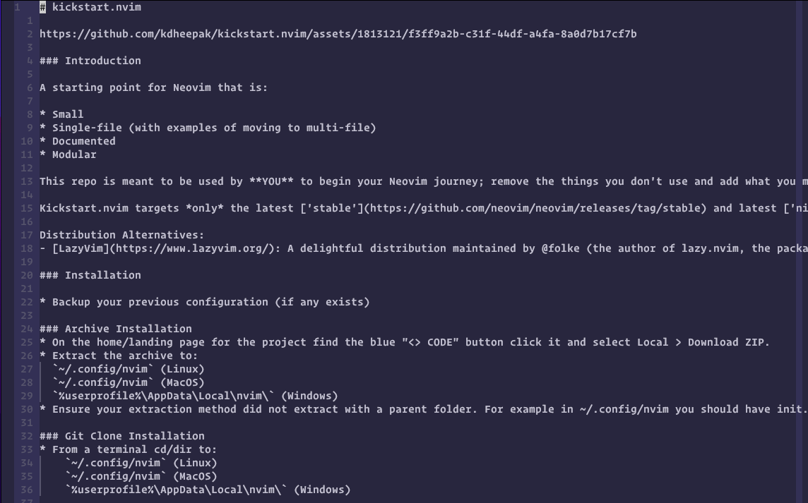
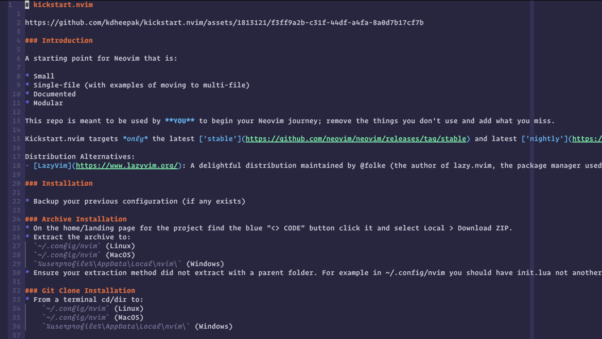

# Noctis.nvim

Forked from [talha-akram/noctis](https://github.com/talha-akram/noctis.nvim). See the README there for the basics.

[This comment](https://github.com/nvim-treesitter/nvim-treesitter/issues/2293#issuecomment-1900679583)
on #2293 of the nvim-treesitter repo revealed that the capture names that would
affect Markdown highlighting were changed.

This caused Markdown files to get no syntax highlighting with Noctis.

Viewing a markdown file with noctis.nvim as is (Using noctis_uva):



After making the change that inspired the fork:



## Setup

This fork allows you to provide overrides to the Noctis
colorscheme setter before the Neovim sets the colorscheme.

**Lazy** 

```lua
{
  'tsclay/noctis.nvim',
  init = function()
    require('noctis_theme').setup({
      NormalBold = { fg = 'blue', bg = 'none', bold = true },
      NormalItalic = { fg = 'blue', bg = 'none', italic = true },
    }, {
        -- To give some missing highlights for *.md
      ['@markup.underline'] = { link = 'Underlined' },
      ['@markup.italic'] = { link = 'NormalItalic' },
      ['@markup.strong'] = { link = 'NormalBold' },
      ['@markup.heading'] = { link = 'Title' },
      ['@markup.raw'] = { link = 'Comment' },
      ['@markup.link'] = { link = 'Identifier' },
      ['@markup.link.url'] = { link = 'helpURL' },
      ['@markup.link.label'] = { link = 'Identifier' },
      ['@markup.list'] = { link = 'Todo' },
    })
  end,
},
```

> I use lazy.nvim for plugin management. Feel free to contribute configs for others!

Let's breakdown what happens in the above:

1. 
